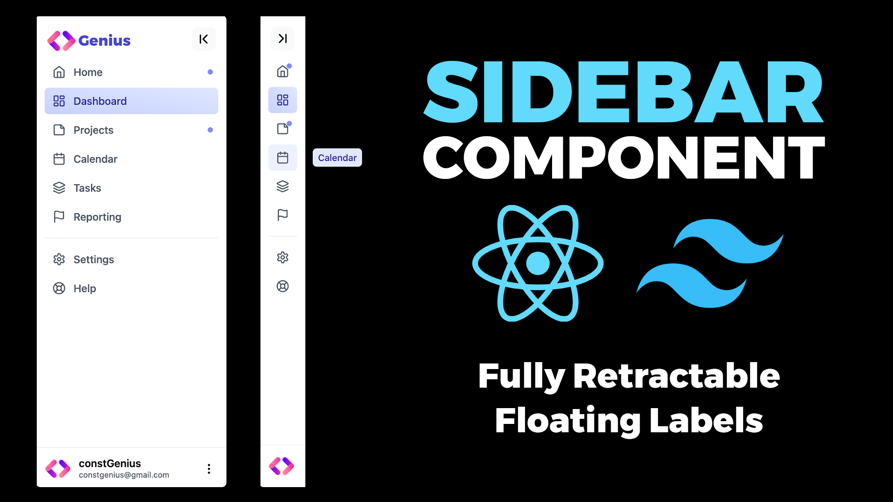

# Build a Retractable Sidebar Component purely in ReactJS and Tailwind CSS | React Sidebar Navigation Menu

The Retractable Sidebar Component, crafted with ReactJS and Tailwind CSS, offers a sleek and responsive solution for implementing retractable sidebars in web applications. Users can effortlessly expand or retract the sidebar with smooth animations, enhancing the overall navigation experience. This component is designed with customization in mind, ensuring it seamlessly integrates into the application's design language.

Youtube Tutorial Link: https://youtu.be/1xH50C4wWy0

